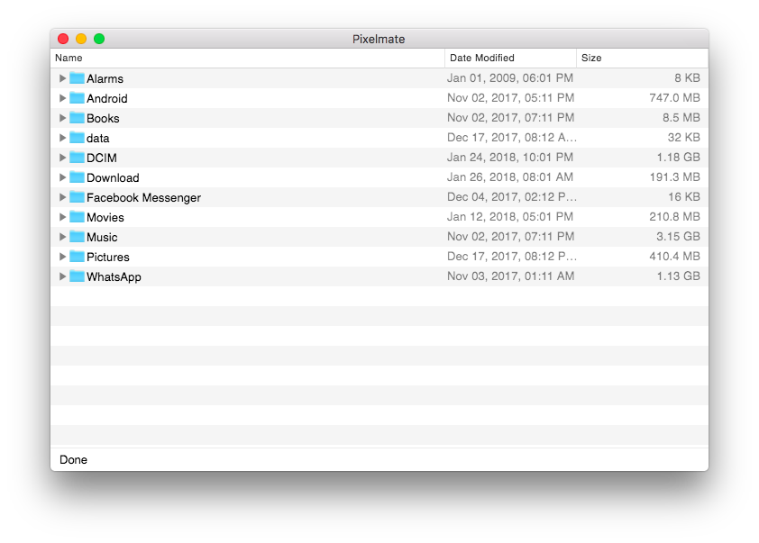

# Pixelmate

A macOS and Windows app built with [Electron](https://electronjs.org/) for managing files on your Google Pixel phone, working around the infamous [Android File Transfer bug](https://www.androidauthority.com/google-pixel-mac-android-file-transfer-problems-743068/) that some Pixel owners experience when transferring files to/from their device.

Pixelmate is designed to look and feel like the native OS X Finder for a familiar user experience:

> **Note:** Pixelmate uses [ADB](https://developer.android.com/studio/command-line/adb.html) behind the scenes, requiring you to enable Developer Mode and USB Debugging on your phone. Check out [this guide](https://www.howtogeek.com/129728/how-to-access-the-developer-options-menu-and-enable-usb-debugging-on-android-4.2/) for detailed instructions.

## Usage

**On Mac**

1. Download the [latest version of Pixelmate](https://github.com/eladnava/pixelmate/releases/latest).

2. Unzip the archive and drag and drop the Pixelmate app into the macOS `Applications` folder.

3. Connect your phone via USB cable (if you have just enabled USB Debugging, make sure to allow USB debugging for this computer via a popup dialog displayed on your device).

4. Launch Pixelmate from Applications or the macOS Spotlight.

**On Windows**

1. Download the [latest version of Pixelmate](https://github.com/eladnava/pixelmate/releases/latest).

2. Unzip the archive and place it into a sperate folder in `C:\program files`

3. Connect your phone via USB cable (if you have just enabled USB Debugging, make sure to allow USB debugging for this computer via a popup dialog displayed on your Pixel).

**Enjoy**

* Explore and manage files on your Pixel's internal SD card like a boss. Drag files and folders into Pixelmate to upload them to your device, or right click remote files and folders to download them to your computer.

> **Pro tip:** You can even use Pixelmate wirelessly, without having to connect your phone via USB cable! Check out [this guide](http://codetheory.in/android-debug-bridge-adb-wireless-debugging-over-wi-fi/) for detailed instructions, and check out [this app](https://github.com/eladnava/wifidev-android) to avoid having to connect the phone to run `adb tcpip` before going wireless.

## Shortcuts

**On Mac**

* `Cmd + ↓` to navigate into a folder
* `Cmd + ↑` to navigate out of a folder
* `Cmd + Delete` to delete a file or folder
* `Cmd + Shift + ↑/↓` to multi-select listings

**On 
**

* `Ctrl + ↓` to navigate into a folder
* `Ctrl + ↑` to navigate out of a folder
* `Ctrl + Del` to delete a file or folder
* `Ctrl + Shift + ↑/↓` to multi-select listings

## To Do

- [x] File/folder multi-selection for multi-delete and multi-download
- [ ] Drag and dropping of files and folders stored on the device to the local computer (pending resolution of an upstream [Electron GitHub issue](https://github.com/electron/electron/issues/11691))

## License

Apache 2.0
